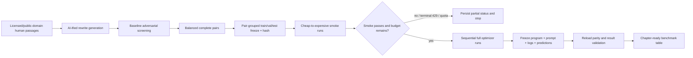

# feat: Rebuild the Chapter 6 optimizer benchmark

> **2026-07-15 acceptance amendment:** The original CUDA-only assumption below
> was superseded after current API research. DSPy 3.2.1 delegates fine-tuning to
> an LM provider and does not itself require CUDA. Chapter 6 now supplies a
> minimal DSPy provider backed by Transformers/TRL/PEFT, and both weight
> optimizers were smoke-tested and fully executed on this Mac's MPS device.

## Overview

Rebuild Chapter 6 as a reproducible adversarial benchmark in which the unoptimized GPT-5.6 Luna detector scores below 50% on a frozen holdout and increasingly sophisticated DSPy optimizers have room to separate themselves. Preserve the complete final output, optimized program, learned prompt, predictions, timing, latency, token usage, and cost for every runnable optimizer while keeping aggregate OpenAI spend below the user's $100 ceiling.

This is a deep plan because it combines data provenance and generation, repeated paid API experiments, twelve duplicated/self-contained notebooks, failure-safe orchestration, model serialization, and chapter-facing benchmark artifacts.

## Problem Frame

The current 202-example dataset produces a 72.3% baseline and lets simple few-shot optimizers approach 100%, obscuring the practical difference between BootstrapRS and newer reflection-driven optimizers such as GEPA. The current notebooks also print only a score: they do not consistently isolate optimization cost from evaluation cost, record inference latency, freeze the resulting program, export the learned prompt, or preserve complete run output.

The experiment needs a harder but honest task. Real human passages that resemble stereotypical AI prose will be paired with model-generated “AI-ified” rewrites that preserve topic and meaning. The pair—not an individual row—will be the split unit so a human passage and its semantic rewrite cannot leak across train, validation, and test. The dataset will be adversarially filtered against the baseline before any optimizer sees the locked holdout.

## Requirements Trace

- **R1 — Isolated delivery:** All work remains on `codex/chapter-6-optimizer-experiment` and ships through a separate PR; `main` is not modified.
- **R2 — Harder dataset:** Build a balanced, provenance-bearing human/AI paired dataset from genuine public-domain or permissively licensed human text and generated AI-ified rewrites.
- **R2a — Quality over row count:** Treat the original made-up rows as replaceable and discard OCR debris, contextless fragments, duplicates, weak/off-topic rewrites, or any pair retained only to meet a quota; a smaller high-quality dataset is preferable to padding to 200 rows.
- **R3 — Sub-50% baseline:** Run documented adversarial dataset rounds until the unoptimized task model scores below 50% on the frozen holdout without changing labels or peeking during optimizer tuning.
- **R4 — Smoke before spend:** Smoke-test every Chapter 6 optimizer notebook with minimal caps before any full run.
- **R5 — Full benchmark:** Run every optimizer that is executable on the available host against the same frozen split and model configuration; explicitly record hardware-blocked CUDA workflows.
- **R6 — Cost safety:** Keep cumulative API spend below $100, reserve $5 for in-flight calls, stop immediately on `insufficient_quota`, and stop after DSPy exhausts bounded retries for a rate-limit error.
- **R7 — Fair measurements:** Record baseline/final accuracy, percentage-point and relative uplift, optimization-only token cost, evaluation cost, optimization wall time, per-example inference latency distribution, and run status.
- **R8 — Frozen outputs:** Save each compiled program, learned prompt, full console transcript, optimizer trace/candidate data where available, per-example predictions, and a reproducibility manifest.
- **R9 — Compelling comparison:** Generate a chapter-ready Markdown/CSV table that makes the quality/cost/time/latency tradeoffs—especially GEPA versus BootstrapRS—plain without overstating results.
- **R10 — Reproducibility and safety:** Fix seeds and dataset hashes, keep source notebooks output-free, redact secrets, validate reload parity, and document incomplete/early-stopped runs rather than presenting them as successful.

## Scope Boundaries

- Update Chapter 6 notebooks, Chapter 6-specific scripts/tests/docs, the Chapter 6 dataset, and generated benchmark artifacts only.
- Do not edit the supplied prose attachment; produce chapter-ready artifacts the author can transfer into the manuscript.
- Do not silently change the task or reflection model to force a desired result. The repository defaults remain `openai/gpt-5.6-luna` and `openai/gpt-5.6-sol` unless an API-compatibility failure requires a documented stop.
- Do not mislabel human passages, hand-edit model predictions, or tune optimizers against the final holdout.
- Do not run CUDA/SGLang fine-tuning on this Apple Silicon host. `bootstrap-finetune.ipynb` and `better-together.ipynb` must pass static/fail-fast smoke validation and receive explicit `hardware_blocked` artifacts; a real full result requires a later NVIDIA host.
- Do not commit API keys, `.env`, provider request headers, or unredacted exception payloads that may contain credentials.
- Do not claim the benchmark proves a universal optimizer ranking; it tests the stated Chapter 6 task and hypothesis.

## Context & Research

### Relevant Code and Patterns

- `chapter06/quickstart-ai-detector.ipynb` contains the canonical setup, signature, metric, deterministic 50/25/25 split, and baseline evaluation copied into all optimizer notebooks.
- `chapter06/*.ipynb` are deliberately self-contained and output-free. Optimizer-specific cells cover LabeledFewShot, BootstrapFewShot, BootstrapRS, KNNFewShot, COPRO, MIPROv2, GEPA (plus a word-limit proposer), SIMBA, Ensemble, BootstrapFinetune, and BetterTogether.
- `chapter06/optimized_programs/*.json` establishes JSON state saving as the existing freeze format, but the files are stale relative to the current notebooks and lack corresponding prompts/metrics.
- Historical `chapter06/build_optimizer_notebooks.py` and `chapter06/validate_notebooks.py` (commit `31eeaa6`) provide a strong pattern for generating duplicated notebook cells from one source and statically checking DSPy API contracts. They were removed for maintenance simplification, so restoration must stay narrowly focused on this reproducible experiment.
- `chapter06/README.md` documents the DSPy 3.2.1/Luna/Sol contract, environment limit variables, KNNFewShot API caveat, and CUDA requirements.
- `README.md` requires cleared source-notebook outputs and secret scans before contribution.
- The current `data/ai_vs_human200.csv` is balanced but has only `text`, `is_ai`, and `notes`; it has no pair/group identifier or source provenance.
- No `docs/solutions/`, `docs/brainstorms/`, project `AGENTS.md`, or existing plan files are present. There are therefore no applicable institutional solution notes beyond the user-supplied instructions.

### External References

- DSPy 3.x documents JSON state saving with `program.save(...)`, MIPROv2 `auto` budgets, BootstrapRS candidate caps, SIMBA step/candidate caps, and GEPA `max_full_evals`/`max_metric_calls`, `log_dir`, `track_stats`, and `detailed_results`: <https://dspy.ai/api/optimizers/GEPA/overview>, <https://dspy.ai/api/optimizers/MIPROv2>, <https://dspy.ai/api/optimizers/BootstrapFewShotWithRandomSearch>, <https://dspy.ai/api/optimizers/SIMBA>.
- Installed DSPy 3.2.1 stores sanitized per-call history with usage and LiteLLM response cost, supports `dspy.track_usage()`, and retries transient/rate-limit errors with exponential backoff through `dspy.LM(num_retries=...)`.
- OpenAI recommends bounded random exponential backoff for rate limits and warns that unsuccessful requests still count toward per-minute limits: <https://developers.openai.com/api/docs/guides/rate-limits>.
- Current official model docs confirm Luna as the cost-sensitive/high-volume model and Sol as the higher-capability model, with current token prices used only as a cross-check against response-reported cost: <https://developers.openai.com/api/docs/models/gpt-5.6-luna>, <https://developers.openai.com/api/docs/models/gpt-5.6-sol>.

## Key Technical Decisions

- **Interpret “Jeeper” as GEPA:** The supplied chapter and local notebook both use GEPA, and no “Jeeper” optimizer exists in the suite.
- **Use 100 semantic pairs (200 rows) only as a target, never a quota:** This retains the chapter's familiar scale while making the task harder. If quality review or adversarial rejection leaves fewer rows, keep balanced complete pairs and record the actual count rather than preserving old made-up rows or padding with weak examples.
- **Treat pair ID as the split key:** Both the human source and its AI rewrite must stay in the same 50/25/25 partition. This prevents topic/content leakage that would exaggerate optimizer performance.
- **Adversarialize before locking optimizer evaluation:** Generate a larger candidate pool, run the unchanged baseline over candidates, retain difficult but label-valid pairs, freeze split IDs and a SHA-256 dataset hash, then prohibit further dataset changes during optimization.
- **Use a sub-50% gate on the locked test split and also report validation score:** This meets the user's baseline target while retaining a separate validation set for optimizer search. Dataset selection may use baseline behavior, but optimizer selection may never use final test labels.
- **Budget by stage with a $95 enforced ceiling:** Reserve $5 for concurrent/in-flight calls. Suggested envelopes are $10 dataset construction/adversarial screening, $5 smoke tests, and $80 full optimization plus final evaluation. Unused stage budget rolls forward, but no stage may cross the global stop.
- **Make terminal retry exhaustion a global stop:** Each LM uses bounded DSPy retries with exponential backoff. A terminal rate-limit error means repeated request retries already failed, so the orchestrator records the partial artifact and stops all later paid runs. `insufficient_quota`/credit-exhaustion text stops immediately.
- **Separate optimization and inference accounting:** Snapshot LM histories before/after compile and before/after evaluation. Report optimization-only cost/time separately from final-test cost and p50/p95/mean per-example latency.
- **Keep source notebooks clean; preserve output as artifacts:** Source `.ipynb` files remain output-free. Full transcripts, raw sanitized LM histories, optimizer-native traces, compiled state, prompts, predictions, and manifests go under `chapter06/results/`.
- **Use JSON state as the primary freeze format:** It is reviewable and safer than pickle. Each program must reload into a fresh `AIDetector` and reproduce a fixed sentinel prediction set. KNN/Ensemble or local-model programs that cannot round-trip as plain state receive a documented supplemental manifest, never an unsafe opaque artifact by default.
- **Use the same test set and task model for the comparison:** Optimizer-specific reflection models and compile mechanics remain part of the optimizer's cost. Final accuracy and latency always use the frozen task program on the same test examples.
- **Report both absolute and relative uplift:** `score - baseline` in percentage points is the primary chapter measure; relative percent uplift is included to remove ambiguity.
- **Order full runs from cheapest to most expensive:** Baseline, LabeledFewShot, BootstrapFewShot, KNNFewShot, BootstrapRS, COPRO, SIMBA, MIPROv2, GEPA, and Ensemble. Smoke measurements and remaining budget may reduce expensive presets, but every deviation is written to the manifest.

## Open Questions

### Resolved During Planning

- **Should GPU notebooks count as completed full runs?** No. This ARM64 macOS host has no NVIDIA CUDA runtime. They count as structurally smoke-tested and explicitly hardware-blocked, not benchmarked.
- **How is “repeated 429” defined?** A rate-limit exception that escapes DSPy's bounded retry loop. Because the LM retries transient/rate-limit failures with exponential backoff, one escaped error represents repeated failure and triggers the requested experiment stop.
- **How will the $100 ceiling be enforced when calls are concurrent?** The experiment refuses to start a new stage at $95 cumulative measured/projected spend, leaving $5 for already in-flight calls and cost-estimation variance.
- **Does latency mean optimization duration or production inference latency?** Record both: compile wall-clock time and final-program per-example inference p50/p95/mean. The chapter table can expose both without conflating them.
- **Should cached calls count as cost?** Report response-billed cost; cache hits with zero/unknown provider cost are marked separately. Full benchmark runs use a unique run ID/rollout context or cleared experiment cache policy so prior smoke calls do not turn full runs into misleading cache hits.

### Deferred to Implementation

- **Exact public-domain source mix:** Select after source/license verification and candidate-quality inspection; record URL, title, author, license/public-domain basis, excerpt boundary, and retrieval date for every human passage.
- **Exact full presets for COPRO/MIPROv2/GEPA/SIMBA:** Choose after smoke cost and runtime measurements. Presets must fit the remaining budget and be recorded verbatim; sophistication may not be simulated by giving simple methods artificially tiny data.
- **Whether the baseline reaches below 50% with 100 complete pairs:** This is an execution-time result. Continue bounded candidate rounds within the dataset budget; if the gate cannot be met honestly, stop before full optimization and report the failed gate.
- **Whether every JSON state round-trips:** Validate per optimizer at execution time and add a transparent supplemental artifact only where DSPy's dynamic program structure requires it.

## High-Level Technical Design

> *This illustrates the intended approach and is directional guidance for review, not implementation specification. The implementing agent should treat it as context, not code to reproduce.*

## Implementation Units

- [ ] **Unit 1: Build and freeze the adversarial paired dataset**

**Goal:** Create a balanced, source-verifiable dataset whose unoptimized Luna baseline is below 50% on a locked holdout without semantic leakage or label manipulation.

**Requirements:** R2, R3, R6, R10

**Dependencies:** None

**Files:**
- Create: `chapter06/build_adversarial_dataset.py`
- Create: `chapter06/data_sources.yaml`
- Create: `data/ai_vs_human_chapter06.csv`
- Create: `data/ai_vs_human_chapter06_splits.json`
- Create: `chapter06/results/dataset/adversarial_rounds.jsonl`
- Create: `chapter06/results/dataset/baseline_gate.json`
- Test: `chapter06/tests/test_adversarial_dataset.py`

**Approach:**
- Gather formal, polished, or generic-sounding human passages from verified public-domain/permissive sources and preserve exact excerpts plus provenance.
- Generate one AI-ified semantic rewrite per source passage with a constrained generation prompt and label it from generation provenance, not detector opinion.
- Screen a candidate pool with the unchanged baseline, retaining difficult complete pairs while preserving a range of topics, lengths, authors, and source types.
- Group-shuffle on `pair_id` with seed 42, freeze train/validation/test membership, write hashes, and never resplit implicitly inside individual notebooks.
- Stop dataset generation before the global budget ceiling; if the honest sub-50 gate fails, persist rounds and stop the experiment before optimizer spend.

**Execution note:** Characterization-first: validate the existing 72%-range behavior, then add the new dataset and gate without altering the detector signature or labels.

**Patterns to follow:**
- `data/ai_vs_human200.csv` columns and expert notes.
- `chapter06/quickstart-ai-detector.ipynb` baseline module and `as_bool` normalization.

**Test scenarios:**
- **Happy path:** 100 valid source pairs produce 200 balanced rows and deterministic 50/25/25 pair-grouped splits.
- **Integrity:** Every `pair_id` has exactly one human and one AI row, and no pair appears in multiple splits.
- **Provenance:** Every human row resolves to a source manifest entry with URL/title/author/license basis; every AI row records generation model/run ID and parent pair.
- **Edge case:** Rejected or too-short excerpts do not leave orphaned AI/human rows or unbalanced labels.
- **Error path:** Duplicate hashes, missing provenance, invalid boolean labels, or source/rewrite text equality fail validation.
- **Gate:** The frozen baseline test score is below 50%, with predictions and dataset hash stored in `baseline_gate.json`.

**Verification:**
- The checked-in dataset is balanced, pair-leakage-free, provenance-complete, deterministically split, and tied to an immutable baseline gate artifact.

- [ ] **Unit 2: Add shared experiment instrumentation and stop controls**

**Goal:** Measure paid experiments consistently and stop safely on budget, repeated rate limits, or exhausted credit.

**Requirements:** R4, R6, R7, R8, R10

**Dependencies:** Unit 1

**Files:**
- Create: `chapter06/experiment_runtime.py`
- Create: `chapter06/run_experiments.py`
- Create: `chapter06/results/README.md`
- Create: `chapter06/results/budget_ledger.json`
- Test: `chapter06/tests/test_experiment_runtime.py`

**Approach:**
- Provide run manifests, monotonic timers, per-call sanitized history capture, token/cost aggregation by model and phase, latency sampling, and atomic result writing.
- Classify API failures into transient retryable, terminal rate-limit, insufficient quota, and unrelated optimizer/code failure. Do not continue paid runs after the first two terminal classes.
- Enforce sequential optimizer runs and a $95 start/continuation ceiling, including smoke/full stage attribution and projected cost based on smoke measurements.
- Preserve partial artifacts on interruption and give every run a terminal status such as `completed`, `failed`, `rate_limited`, `credit_exhausted`, `budget_stopped`, or `hardware_blocked`.

**Patterns to follow:**
- DSPy 3.2.1 `LM.history`, `dspy.track_usage()`, sanitized BaseLM history entries, and JSON program saving.
- OpenAI bounded exponential-backoff guidance; DSPy's existing `num_retries` mechanism rather than unbounded custom resubmission.

**Test scenarios:**
- **Happy path:** Synthetic histories aggregate prompt/completion/reasoning/cached tokens and response costs separately for compile and evaluation.
- **Latency:** Known sample durations yield correct mean/median/p50/p95 and request counts.
- **Budget edge:** A projected stage crossing $95 is refused while a stage below the threshold is allowed.
- **Error path:** Simulated `insufficient_quota` stops immediately; an escaped rate-limit error marks the run and stops later stages; ordinary code errors fail only the current smoke/full run according to policy.
- **Privacy:** Redaction removes API keys, authorization headers, and `.env` values from logs and manifests.
- **Interruption:** An exception after program creation still writes a partial manifest and console transcript.

**Verification:**
- Offline tests prove accounting, redaction, status, and stop-state behavior without making API calls.

- [ ] **Unit 3: Make all notebooks reproducible, instrumented, and artifact-producing**

**Goal:** Apply the frozen split, smoke/full modes, measurements, and artifact contract consistently across all Chapter 6 notebooks while retaining top-to-bottom self-contained readability.

**Requirements:** R4, R5, R7, R8, R10

**Dependencies:** Units 1–2

**Files:**
- Create: `chapter06/build_optimizer_notebooks.py`
- Create: `chapter06/validate_notebooks.py`
- Modify: `chapter06/quickstart-ai-detector.ipynb`
- Modify: `chapter06/labeled-few-shot.ipynb`
- Modify: `chapter06/bootstrap-few-shot.ipynb`
- Modify: `chapter06/bootstrap-random-search.ipynb`
- Modify: `chapter06/knn-few-shot.ipynb`
- Modify: `chapter06/copro.ipynb`
- Modify: `chapter06/miprov2.ipynb`
- Modify: `chapter06/gepa.ipynb`
- Modify: `chapter06/simba.ipynb`
- Modify: `chapter06/ensemble.ipynb`
- Modify: `chapter06/bootstrap-finetune.ipynb`
- Modify: `chapter06/better-together.ipynb`
- Test: `chapter06/tests/test_notebooks.py`

**Approach:**
- Restore a narrow notebook generator/validator so shared setup, metrics, split loading, run mode, and artifact cells cannot drift across twelve JSON notebooks.
- Preserve each notebook's optimizer-specific teaching cell and the GEPA word-limit proposer section.
- Add `smoke` and `full` profiles with explicit, printed optimizer parameters and seeds; no hidden commented “full” cell is required to reproduce the final run.
- Save state, prompt, logs, native optimizer details, history, predictions, and metrics into a run-specific directory while leaving source notebook execution counts/outputs empty.
- GPU notebooks fail before install/compile spend when CUDA is unavailable and emit `hardware_blocked` manifests.

**Patterns to follow:**
- The historical generator/validator from commit `31eeaa6` for shared-cell construction and AST/API checks.
- The current KNNFewShot constructor/compile caveat and GEPA proposer implementation.

**Test scenarios:**
- **Structure:** All twelve notebooks are valid nbformat 4 JSON with empty outputs and parseable Python after notebook magics are normalized.
- **Parity:** Canonical shared cell hashes match across every applicable notebook.
- **API contracts:** Optimizer constructors/compile calls match installed DSPy 3.2.1 signatures, including KNN and Ensemble exceptions.
- **Profiles:** Every runnable optimizer defines bounded smoke and full parameters; full parameters are serializable into the manifest.
- **Artifacts:** Each runnable notebook calls the shared artifact finalizer for both success and failure; prompt and state paths are optimizer-specific.
- **GPU path:** On non-CUDA hosts, fine-tune notebooks stop with a clean hardware status before launching a provider or downloading a training model.

**Verification:**
- Static validation passes for all notebooks and diff inspection shows only generated shared cells plus intentional optimizer-specific teaching content.

- [ ] **Unit 4: Run bounded smoke tests and calibrate full budgets**

**Goal:** Prove each optimizer path works cheaply before committing to full paid runs and convert observed smoke usage into transparent full-run presets.

**Requirements:** R4, R5, R6, R10

**Dependencies:** Units 1–3

**Files:**
- Create: `chapter06/results/smoke/summary.json`
- Create: `chapter06/results/smoke/summary.md`
- Create: `chapter06/results/smoke/<optimizer>/run.log` (one per notebook)
- Modify: `chapter06/full_run_config.yaml`
- Test: `chapter06/tests/test_smoke_results.py`

**Approach:**
- Run the baseline and every CPU-capable optimizer with minimal train/validation/test and candidate/step/full-eval caps in cheapest-first order.
- Exercise both GEPA paths only if the primary GEPA smoke succeeds; treat the word-limited proposer as an auxiliary result, not a duplicate headline optimizer.
- Capture CUDA notebook hardware blocks as successful environment validation, not optimizer scores.
- Reject full-run configurations whose smoke failure, cost projection, or remaining global budget makes them unsafe. Record any reduced preset rather than silently changing it.

**Test scenarios:**
- **Happy path:** Every CPU notebook completes a smoke run with a valid score, nonnegative accounting, prompt/state artifact, and reload check.
- **Failure path:** A notebook exception preserves its log and prevents its own full run while allowing unrelated code-failure smokes to continue.
- **Global stop:** Rate-limit retry exhaustion, credit exhaustion, or the $95 guard prevents all subsequent paid smokes/full runs.
- **Projection:** Full preset estimates use observed per-call/token behavior and sum to at most the remaining budget envelope.

**Verification:**
- The smoke summary accounts for all twelve notebooks with no ambiguous missing status and authorizes only demonstrated full configurations.

- [ ] **Unit 5: Execute and freeze the full optimizer benchmark**

**Goal:** Produce complete, reproducible final artifacts for every runnable optimizer on the frozen split.

**Requirements:** R5, R6, R7, R8, R10

**Dependencies:** Unit 4 and a passing sub-50 baseline gate

**Files:**
- Replace: `chapter06/optimized_programs/*.json` with current completed-run states where applicable
- Create: `chapter06/results/final/<optimizer>/manifest.json`
- Create: `chapter06/results/final/<optimizer>/run.log`
- Create: `chapter06/results/final/<optimizer>/lm_history.jsonl`
- Create: `chapter06/results/final/<optimizer>/optimizer_trace.json`
- Create: `chapter06/results/final/<optimizer>/prompt.md`
- Create: `chapter06/results/final/<optimizer>/predictions.csv`
- Create: `chapter06/results/final/<optimizer>/metrics.json`
- Test: `chapter06/tests/test_final_artifacts.py`

**Approach:**
- Execute approved configurations sequentially from cheap to expensive, checking cumulative measured spend and projected next-run spend between optimizers.
- Measure baseline and each final program on the same locked test order; record correctness and latency for every row.
- Export all learned predictor instructions and demonstrations in a readable prompt document, plus optimizer-native candidate/statistics data when available.
- Save console output without truncation, sanitized LM request/response history, exact environment/configuration, git SHA, dataset/split hashes, package versions, timestamps, and early-stop reason.
- Reload each completed JSON state into a fresh program and verify predictions on a fixed sentinel subset before calling it frozen.

**Test scenarios:**
- **Completed run:** Required artifacts exist, parse, agree on run ID/config/hash/status, and contain no secrets.
- **Metric consistency:** Accuracy recomputed from `predictions.csv` equals `metrics.json`; costs recomputed from history equal phase totals within rounding tolerance.
- **Reload parity:** Freshly loaded program matches original outputs on the sentinel examples.
- **Early stop:** A partial run lacks no explanatory status and is excluded from headline ranking while retaining all output produced before the stop.
- **No test leakage:** Optimizer traces/configs reference train/validation IDs only; test IDs appear only in final evaluation artifacts.

**Verification:**
- Every runnable optimizer has a complete frozen artifact set or an explicit terminal partial status, and cumulative billed/estimated API cost remains below the authorized ceiling.

- [ ] **Unit 6: Generate and validate the chapter-facing comparison**

**Goal:** Turn raw runs into a compelling, accurate table and narrative-ready evidence about optimizer sophistication and tradeoffs.

**Requirements:** R7, R9, R10

**Dependencies:** Unit 5

**Files:**
- Create: `chapter06/summarize_results.py`
- Create: `chapter06/results/benchmark.csv`
- Create: `chapter06/results/benchmark.md`
- Create: `chapter06/results/hypothesis.md`
- Test: `chapter06/tests/test_benchmark_summary.py`

**Approach:**
- Generate rows directly from manifests/predictions rather than hand-copying values.
- Include baseline accuracy, optimized accuracy, percentage-point uplift, relative uplift, optimization cost, final evaluation cost, optimization time, p50/p95 inference latency, prompt length, and status.
- Add paired uncertainty/significance context where the sample size supports it, and a focused GEPA-versus-BootstrapRS comparison of extra accuracy per dollar/minute.
- State whether the “more sophisticated optimizers make a bigger difference” hypothesis was supported, mixed, or rejected by actual results; never rewrite the experiment to force the desired conclusion.

**Test scenarios:**
- **Happy path:** Completed manifests produce deterministic CSV and Markdown tables sorted in chapter order.
- **Math:** Percentage-point/relative uplift, time units, latency percentiles, and cost totals are correct for fixture data.
- **Partial statuses:** Hardware-blocked, budget-stopped, rate-limited, or failed runs remain visible but are not assigned fabricated scores/ranks.
- **Traceability:** Every displayed number identifies its source manifest/prediction file and dataset hash.

**Verification:**
- The final table can be pasted into Chapter 6 and every cell is mechanically reproducible from checked-in artifacts.

- [ ] **Unit 7: Update documentation and prepare the isolated PR**

**Goal:** Make the experiment understandable and reviewable, verify repository hygiene, and deliver it in the requested separate PR.

**Requirements:** R1, R8, R9, R10

**Dependencies:** Units 1–6

**Files:**
- Modify: `chapter06/README.md`
- Modify: `README.md` only if the Chapter 6 dataset/run instructions or spend estimate materially change
- Modify: `docs/plans/2026-07-14-001-feat-chapter-6-optimizer-benchmark-plan.md` (check completed units)
- Test: `chapter06/tests/test_documented_commands.py`

**Approach:**
- Document dataset provenance, frozen split, smoke/full profiles, cost controls, stop semantics, artifact layout, GPU limitation, and exact reproduction entry points.
- Reconcile the notebook map and optimized-program list with actual outputs.
- Run notebook/static/unit validations, secret scans, JSON/CSV consistency checks, and a final diff review before commit/push/PR.
- Include actual spend, stopped/skipped runs, result headline, and artifact paths in the PR body.

**Test scenarios:**
- **Docs parity:** Every documented notebook/artifact/config path exists and every optimizer status in docs matches the benchmark manifest.
- **Security:** No `.env`, API key pattern, authorization header, or raw secret appears in staged files.
- **Notebook hygiene:** Source notebooks have no execution counts or outputs despite preserved result logs elsewhere.
- **Git isolation:** Branch diff is based on `origin/main` and contains only Chapter 6 experiment/plan/data files.

**Verification:**
- A separate PR from `codex/chapter-6-optimizer-experiment` opens successfully with all checks passing and complete experiment artifacts linked in its description.

## System-Wide Impact

- **Interaction graph:** Dataset builder → frozen split manifest → generated notebook setup → experiment runtime → per-optimizer artifacts → benchmark summarizer → Chapter 6 README/PR. Changing the dataset schema affects all twelve notebooks and every result validator.
- **Error propagation:** Dataset/gate failures block all optimizer runs. Ordinary optimizer smoke failures block that optimizer's full run. Escaped rate-limit, quota, or global-budget events stop every later paid run and persist a global stop reason.
- **State lifecycle risks:** Partial logs and program states can exist after interruption; manifests must be written atomically and status transitions must be monotonic. Full-run cache isolation prevents smoke cache hits from falsifying cost/time.
- **API surface parity:** Shared duplicated notebook cells, CLI orchestration, result schema, README examples, and tests must use identical profile names, dataset paths, model slugs, split hashes, and status vocabulary.
- **Integration coverage:** Static notebook validation alone cannot prove API execution, state reload, cost accounting, or artifact completeness. Smoke runs provide cross-layer validation before full runs; final artifact tests recompute results independently.

## Success Metrics

- Frozen baseline accuracy is below 50% on a balanced, provenance-complete, pair-leakage-free test set.
- All ten CPU/API workflows (baseline plus nine optimizer/program-transform notebooks) receive smoke statuses; all eligible optimizer notebooks receive completed full artifacts unless a documented global stop occurs.
- Both CUDA notebooks receive deterministic `hardware_blocked` records on this host and remain runnable on an NVIDIA environment.
- Every completed optimizer has a reloadable frozen state (or a documented DSPy serialization exception), full transcript, sanitized history, prompt, predictions, metrics, and manifest.
- The benchmark table includes accuracy, percentage-point and relative uplift, optimization cost, evaluation cost, optimization time, and p50/p95 inference latency.
- Measured/projected cumulative API spend never exceeds $100 and new paid stages stop at $95.
- The final analysis truthfully resolves the GEPA-versus-BootstrapRS hypothesis from the data.

## Risks & Dependencies

- **Adversarial selection overfits to Luna:** Mitigate with diverse sources, complete-pair selection, locked group splits, no optimizer test peeking, and explicit framing that the benchmark is baseline-adversarial.
- **AI rewrite provenance is mistaken for stylistic certainty:** Labels come from generation provenance, not text “tells”; record prompt/model/run IDs and keep exact human source excerpts.
- **Copyright/license ambiguity:** Use only verified public-domain/permissive sources and store the basis per excerpt. Reject ambiguous sources rather than relying on attribution alone.
- **Cost undercount from parallel calls or cache:** Use response-reported cost/history, unique full-run cache context, sequential optimizers, a $5 buffer, and stage projections from smoke data.
- **Rate limits waste retries:** Keep DSPy's retry count bounded. OpenAI notes failed retries consume limit capacity, so an escaped error triggers a global stop rather than another outer retry loop.
- **Optimizer stochasticity weakens comparison:** Fix all available seeds, record versions/configs, preserve candidate traces, and avoid cherry-picking reruns. A rerun due to code/API failure must be labeled with both attempts.
- **Small holdout makes ranking noisy:** Retain roughly 50 test rows, report exact counts and uncertainty/pairwise disagreement, and avoid universal claims.
- **Notebook duplication drifts:** Generate and validate shared cells from one canonical script while preserving self-contained rendered notebooks.
- **Full run exceeds available time:** Run cheap-to-expensive, persist after each optimizer, and leave honest partial statuses if the user-requested API stop condition occurs.
- **CUDA gap:** Apple Silicon cannot validate actual fine-tuning. The PR must state this clearly and provide an NVIDIA reproduction path rather than implying full coverage.

## Phased Delivery

### Phase 1 — Dataset gate

- Build candidates, verify provenance, adversarially screen, freeze the split, and stop unless the honest baseline gate passes.

### Phase 2 — Harness and smoke

- Instrument/regenerate notebooks, run offline tests, then execute bounded smoke runs and choose safe full presets.

### Phase 3 — Full experiment and freeze

- Execute sequential paid runs, persist complete artifacts after each optimizer, reload-check programs, and stop on budget/rate/quota conditions.

### Phase 4 — Chapter assets and PR

- Generate tables/analysis, update docs, complete review/tests/secret scans, commit, push, and open the isolated PR.

## Documentation / Operational Notes

- Keep a concise `chapter06/results/README.md` describing which artifacts are primary, which are raw, and how to interpret partial statuses.
- Do not commit executed source notebooks; `run.log` and structured artifacts are the permanent output record.
- Include exact total API spend and any unexecuted expensive/GPU workflows in both `benchmark.md` and the PR body.
- If credit is exhausted or a terminal rate-limit error occurs, end the experiment immediately after flushing artifacts and wait for the user, as requested.

## Sources & References

- **User-provided chapter draft:** `/Users/hammermt/.codex/attachments/0bbb8360-2993-47b4-98de-b5d9f367574a/pasted-text.txt`
- Related code: `chapter06/quickstart-ai-detector.ipynb`, `chapter06/*.ipynb`, `chapter06/optimized_programs/*.json`, `chapter06/README.md`, `data/ai_vs_human200.csv`
- Historical patterns: commit `31eeaa6` (`chapter06/build_optimizer_notebooks.py`, `chapter06/validate_notebooks.py`)
- DSPy optimizer docs: <https://dspy.ai/api/optimizers/GEPA/overview>, <https://dspy.ai/api/optimizers/MIPROv2>, <https://dspy.ai/api/optimizers/BootstrapFewShotWithRandomSearch>, <https://dspy.ai/api/optimizers/SIMBA>
- OpenAI rate-limit guide: <https://developers.openai.com/api/docs/guides/rate-limits>
- OpenAI model docs: <https://developers.openai.com/api/docs/models/gpt-5.6-luna>, <https://developers.openai.com/api/docs/models/gpt-5.6-sol>
